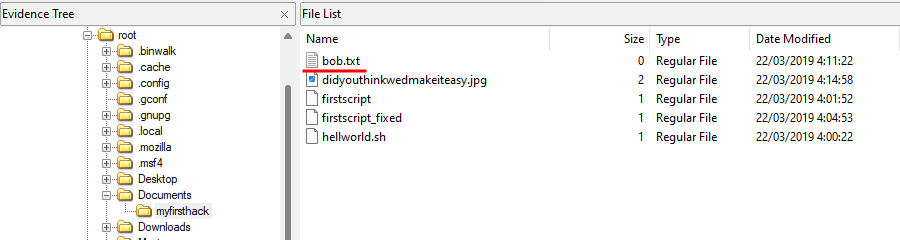

<h1 style="text-align:center;font-size:40px;margin-top: 200px">Informe pericial informático</h1>
<h2 style="text-align:left;font-size:30px;margin-top: 50px">ID:</h2> 
<h2 style="text-align:left;font-size:30px;">82767906Z-12052023</h2>
<h2 style="text-align:left;font-size:30px;margin-top: 50px">Investigador:</h2> 
<h2 style="text-align:left;font-size:30px;">Sebastian Castro - 54201087T</h2>
<h2 style="text-align:left;font-size:30px;margin-top: 50px">Destinatario:</h2> 
<h2 style="text-align:left;font-size:30px;">D. Axel Garrido - 82767906Z (Tech Santiago)</h2>
<h2 style="text-align:left;font-size:30px;margin-top: 50px">Fecha:</h2>
<h2 style="text-align:left;font-size:30px;">07/12/2020</h2>

<div style="page-break-after: always;"></div>

<!-- x
H: <div style="font-size: 9px; margin-left: 1cm;"> <span>Informe pericial informático</span></div>

F: <div style="font-size: 9px; margin-left: 1cm;"> <span>82767906Z-12052023</span></div> <div style="font-size: 9px; margin-left: auto; margin-right: 1cm; "> <span class='pageNumber'></span> / <span class='totalPages'></span></div>
-->

<h2>Índice</h2>

<!-- vscode-markdown-toc -->
* 1. [Resumen ejecutivo](#Resumenejecutivo)
	* 1.1. [Presentación](#Presentacin)
	* 1.2. [Objetivo y alcance](#Objetivoyalcance)
	* 1.3. [Información del incidente](#Informacindelincidente)
    	* 1.3.1 [Listado de evidencias obtenidas](#Listadodeevidenciasobtenidas)
    	* 1.3.2 [Resultados del análisis](#Resultadosdelanálisis)
	* 1.4. [Conclusiones](#Conclusiones)
* 2. [Informe técnico](#Informetcnico)
	* 2.1. [Presentación](#Presentacin-1)
	* 2.2. [Metodología](#Metodologa)
	* 2.3. [Procedimiento](#Procedimiento)
	* 2.4. [Conclusiones](#Conclusiones-1)
	* 2.5. [Anexos](#Anexos)

<!-- vscode-markdown-toc-config
	numbering=true
	autoSave=true
	/vscode-markdown-toc-config -->
<!-- /vscode-markdown-toc -->

<div style="page-break-after: always;"></div>

## 1. <a name='Resumenejecutivo'></a>Resumen ejecutivo

### 1.1. <a name='Presentacin'></a>Presentación

El día 10 de Diciembre de 2020, se notifica al equipo informático de un incidente, se ha contactado con el forense de seguridad debido a la detección de un incidente de seguridad con un indicador de alerta relevante. El solicitante nos ha encomendado la tarea de investigar las vulnerabilidades que fueron explotadas, el método utilizado y la identificación del responsable. Parece ser que el incidente de seguridad ha afectado a un equipo Windows, siendo el objetivo de un ataque proveniente de un sistema Debian. Ambos equipos se encuentran en la misma oficina, el equipo Linux es un puesto de trabajo portátil mientras que el equipo Windows no dispone de acceso físico, tiene conexión a internet y se mantiene siempre encendido.

Se procede a sacar una muestra del disco de cada equipo y un volcado de la memoria RAM del equipo víctima.

El solicitante nos indica que:
- ambos equipos disponian de conexión a internet.
- el equipo Linux era el puesto de trabajo de un empleado (Empleado 1) que fue despedido, desde entonces nadie utilizo ese equipo.
- El equipo Windows es un entorno de pruebas conectado a la red para los empleados de sistemas y solo se tiene acceso remoto.
- En las cámara de seguridad no se detecta ningun acceso a el equipo Windows.


### 1.2. <a name='Objetivoyalcance'></a>Objetivo y alcance

Se analizaran las muestras de disco de el equipo atacante para determinar de que forma logro el acceso al equipo víctima.

Se analizaran las muestras tanto de disco como del volcado de memoria del equipo víctima en busca de información del acceso no autorizado como determinar el ataque utilizado, el malware que pueda tener instalado el dispositivo y el alcance que puede tener el ataque.

<div style="page-break-after: always;"></div>

### 1.3. <a name='Informacindelincidente'></a>Información del incidente

#### 1.3.1. <a name='Listadodeevidenciasobtenidas'></a> Listado de evidencias obtenidas

Se obtienen tres muestras diferentes para el análisis:

- 1) Copia del único disco del equipo Debian
- 2) Copia del unico disco del equipo Windows
- 3) Volcado de memoria RAM del equipo Windows

<div align='center'></div>

#### 1.3.2. <a name='Resultadosdelanálisis'></a> Resultados del análisis

<div align='center'></div>

- **20/03/2019:** Se obtiene acceso como usuario root.
- **22/03/2019:** Es descargado Mimikatz en el equipo Debian, exploit que extrae contraseñas almacenadas en la memoria, que pudo ser utilizado en el equipo Windows.
- **07/12/2020:** Los empleados de sistemas detectan lentitud. 

<div style="page-break-after: always;"></div>

### 1.4. <a name='Conclusiones'></a>Conclusiones

- El empleado logro elevar privilegios en su equipo debian.
- No existen archivos de log que asocien la IP de Empleado 1 con la del equipo Windows el día **22/03/2019**, puede ser que los borrase, ese mismo día el empleado fue despedido por utilizar los equipos de la empresa de forma inadecuada.
-Durante el análisis el día **07/12/2020** se detecta un troyano el el equipo víctima `pytcw.exe`.

<div style="page-break-after: always;"></div>

## 2. <a name='Informetcnico'></a>Informe técnico

### 2.1. <a name='Presentacin-1'></a>Presentación

El día 10 de Diciembre de 2020, se notifica al equipo informático de un incidente, se ha contactado con el forense de seguridad debido a la detección de un incidente de seguridad con un indicador de alerta relevante. El solicitante nos ha encomendado la tarea de investigar las vulnerabilidades que fueron explotadas, el método utilizado y la identificación del responsable. Parece ser que el incidente de seguridad ha afectado a un equipo Windows, siendo el objetivo de un ataque proveniente de un sistema Debian. Ambos equipos se encuentran en la misma oficina, el equipo Linux es un puesto de trabajo portátil mientras que el equipo Windows no dispone de acceso físico, tiene conexión a internet y se mantiene siempre encendido.

Se procede a sacar una muestra del disco de cada equipo y un volcado de la memoria RAM del equipo víctima.

El solicitante nos indica que:
- ambos equipos disponian de conexión a internet.
- el equipo Linux era el puesto de trabajo de un empleado (Empleado 1) que fue despedido, desde entonces nadie utilizo ese equipo.
- El equipo Windows es un entorno de pruebas conectado a la red para los empleados de sistemas y solo se tiene acceso remoto.
- En las cámara de seguridad no se detecta ningun acceso a el equipo Windows.

<div style="page-break-after: always;"></div>

### 2.2. <a name='Metodologa'></a>Metodología

Una vez en la oficina donde se adquieren las evidencias, nos encontramos con el equipo Linux ( puesto de trabajo ) apagado y guardado, por otro lado, en otra sala videovigilada esta la máquina Windows ( víctima ) encendida.

En el primer equipo clonamos el único disco, en el segundo realizamos un volcado de memoria live y posteriormente clonamos el disco con el equipo apagado.


### 2.3. <a name='Procedimiento'></a>Procedimiento

#### Atacante

El hash md5 de la muestra del equipo atacante es: `26bcca1cb84d6d1b3b04f1c9f44d9d76`

Procedemos a analizar la copia de disco utilizando `FTK imager`

En el directorio `/var/log/installer` hay un archivo `lsb-release`, su contenido es:

```sh
❯ cat lsb-release
DISTRIB_ID=Debian
DISTRIB_DESCRIPTION="Kali GNU/Linux installer"
DISTRIB_RELEASE="2017.1 (kali-rolling) - installer build 20171009"
X_INSTALLATION_MEDIUM=cdrom
```

Es un sistema **Kali 2017.1**.

<div align='center'></div>

En el escritorio existe el archivo de texto `/root/Desktop/Checklist` en el que indica que quiere ganarse la confianza de Bob, aprender a hackear y obtener beneficios.

```txt
Check List:

- Gain Bob's Trust
- Learn how to hack
- Profit
```

Nos dirigimos a la carpeta `/root/Downloads` y encontramos el archivo `mimikatz_trunk.zip`.

- Se utiliza para obtener datos de inicios de sesión.
- Obtiene las contraseñas de la memoria de windows en texto plano.

En `/root/Desktop` esta el fichero previamente encontrado en descargas extraído, `mimikatz`,  dentro de el hay un `.exe`.

El primer punto de la checklist dice *Gain Bob's Trust* o *Gana la confianza de Bob*, Ademas también existe una carpeta en `/root/Documents/myfirsthack` que tiene un archivo `bob.txt`.

<div align='center'></div>

En el directorio `/var/log/` buscamos en el archivo `auth.log`.

```sh
❯ cat auth.log | grep 11:26
Mar 20 11:26:22 KarenHacker su[4060]: Successful su for postgres by root
Mar 20 11:26:22 KarenHacker su[4060]: + ??? root:postgres
Mar 20 11:26:22 KarenHacker su[4060]: pam_unix(su:session): session opened for user postgres by (uid=0)
Mar 20 11:26:22 KarenHacker su[4060]: pam_systemd(su:session): Cannot create session: Already occupied by a session
Mar 20 11:26:22 KarenHacker su[4060]: pam_unix(su:session): session closed for user postgres
```

Consiguió hacer `su` 6 veces con el usuario **postgres**.

#### Víctima

El hash md5 de la muestra de disco del equipo víctima es: `2de24a6d62de35e1c6401f6b35fe24f8`

El hash md5 de la muestra de memoria del equipo víctima es: `0df83657104ca59895154656fcfad9cc`

Procedemos a sacar la mayor información posible de la maquina utilizando la herramienta `volatility`.

Obtencion de el nombre del equipo.

```bash
❯ volatility -f caso1Volatility.dmp --profile=Win7SP1x64 envars | grep -e 'Pid' -e 'COMPUTERNAME'                    
Volatility Foundation Volatility Framework 2.6.1
Pid      Process              Block              Variable          Value  
     368 wininit.exe          0x00000000002e9b20 COMPUTERNAME      W7BASE 
     404 winlogon.exe         0x000000000039dec0 COMPUTERNAME      W7BASE
```

El nombre del equipo es: **`W7BASE`**

Buscamos los procesos con `pstree` y filtramos para que no nos aparezcan procesos.

```sh
❯ volatility -f caso1Volatility.dmp --profile=Win7SP1x64 pstree | grep -v "\.\."
Volatility Foundation Volatility Framework 2.6.1
Name                                                  Pid   PPid   Thds   Hnds Time

---

0xfffffa80028e1420:csrss.exe                         320    312      9    357 2020-12-07 18:19:15 UTC+0000
0xfffffa80018cb060:wininit.exe                       368    312      3     73 2020-12-07 18:19:16 UTC+0000
. 0xfffffa800294fb30:lsass.exe                        472    368      6    582 2020-12-07 18:19:16 UTC+0000
. 0xfffffa8002941b30:services.exe                     464    368      7    188 2020-12-07 18:19:16 UTC+0000
. 0xfffffa80029517b0:lsm.exe                          480    368     10    141 2020-12-07 18:19:16 UTC+0000
0xfffffa80018c4040:System                              4      0     81    553 2020-12-07 18:19:15 UTC+0000
. 0xfffffa80021017f0:smss.exe                         248      4      2     29 2020-12-07 18:19:15 UTC+0000
0xfffffa80022fbb30:cmd.exe                          2796   1668      2     77 2020-12-07 18:28:51 UTC+0000
0xfffffa80018ccb30:csrss.exe                         376    360      9    424 2020-12-07 18:19:16 UTC+0000
. 0xfffffa80028dc7d0:conhost.exe                     3436    376      2     50 2020-12-07 18:29:33 UTC+0000
. 0xfffffa80030b7890:conhost.exe                     2396    376      2     56 2020-12-07 18:19:41 UTC+0000
. 0xfffffa800232d630:conhost.exe                     4076    376      2     50 2020-12-07 18:57:12 UTC+0000
. 0xfffffa80022bcb30:conhost.exe                     2868    376      2     50 2020-12-07 18:28:51 UTC+0000
. 0xfffffa80030e3900:conhost.exe                     2648    376      2     54 2020-12-07 18:20:04 UTC+0000
0xfffffa8002906230:winlogon.exe                      404    360      3    109 2020-12-07 18:19:16 UTC+0000
0xfffffa8002e84b30:explorer.exe                      896   1376     39   1207 2020-12-07 18:19:30 UTC+0000
. 0xfffffa80022b2b30:notepad.exe                     2732    896      4    291 2020-12-07 18:20:23 UTC+0000
. 0xfffffa8002f3eb30:haboer.exe                      1028    896     13   1071 2020-12-07 18:19:31 UTC+0000
. 0xfffffa8003135750:cmd.exe                         2640    896      1     20 2020-12-07 18:20:04 UTC+0000
. 0xfffffa800196eb30:firefox.exe                     1608    896      0 ------ 2020-12-07 18:22:18 UTC+0000
. 0xfffffa80030b6b30:cmd.exe                         2388    896      1     23 2020-12-07 18:19:41 UTC+0000
. 0xfffffa800297b060:7zFM.exe                        1484    896      3    162 2020-12-07 18:53:53 UTC+0000
. 0xfffffa8001dd2340:iexplore.exe                    2948    896     16    432 2020-12-07 18:56:33 UTC+0000
. 0xfffffa8002f33340:VBoxTray.exe                    2012    896      6    156 2020-12-07 18:19:31 UTC+0000
. 0xfffffa8002f48b30:AsustoMucho.ex                  1004    896      7    221 2020-12-07 18:19:31 UTC+0000
. 0xfffffa8001b53060:perfmon.exe                     2216    896     17    320 2020-12-07 18:28:11 UTC+0000
0xfffffa800232d060:cmd.exe                          2988   3884      2     76 2020-12-07 18:57:12 UTC+0000
0xfffffa80028ddb30:cmd.exe                          3428   3296      2     76 2020-12-07 18:29:33 UTC+0000
0xfffffa8001be42e0:firefox.exe                      2996    852     33    446 2020-12-07 18:56:11 UTC+0000
. 0xfffffa80020f76a0:firefox.exe                     2852   2996      9    184 2020-12-07 18:56:21 UTC+0000
0xfffffa8002eb1b30:pytcw.exe                        3996   1640      9    255 2020-12-07 18:58:36 UTC+0000
```

Entre ellos encontramos un proceso con nombre sospechoso: **`AsustoMucho.ex`** con PID **1004**

Exportamos el proceso:

```sh
❯ volatility -f caso1Volatility.dmp --profile=Win7SP1x64 procdump --pid 1004 -D ./dump/
Volatility Foundation Volatility Framework 2.6.1                                       
Process(V)         ImageBase          Name                 Result                      
------------------ ------------------ -------------------- ------                      
0xfffffa8002f48b30 0x0000000000270000 AsustoMucho.ex       OK: executable.1004.exe
```

Podemos analizarlo en **Virustotal**:


Efectivamente lo detecta como un archivo malicioso.

Podemos obtener todas las conexiónes establecidas por HTTPS

```sh
❯ volatility -f caso1Volatility.dmp --profile=Win7SP1x64 netscan | grep -e 'Offset' -e ':443'                        
Volatility Foundation Volatility Framework 2.6.1                                       
Offset(P)          Proto    Local Address                  Foreign Address      State            Pid      Owner          Created
0x36281010         TCPv4    10.0.2.15:49262                216.58.213.3:443     ESTABLISHED      1608     firefox.exe
0x3aab7010         TCPv4    -:49284                        33.161.122.39:443    ESTABLISHED      1608     firefox.exe
0x3abc2010         TCPv4    -:49263                        188.165.205.194:443  CLOSED           1608     firefox.exe
0x464ebcf0         TCPv4    -:49286                        118.45.153.189:443   ESTABLISHED      1608     firefox.exe
0x62341010         TCPv4    -:49285                        -:443                ESTABLISHED      1608     firefox.exe
0x7fa7ecf0         TCPv4    10.0.2.15:49325                2.19.61.200:443      ESTABLISHED      2464     iexplore.exe          
0x7fdf0580         TCPv4    10.0.2.15:49326                2.19.61.200:443      ESTABLISHED      2464     iexplore.exe          
0x7fe0f450         TCPv4    10.0.2.15:49525                160.153.75.34:443    ESTABLISHED      3996     pytcw.exe
```

La conexión más sospechosa es la de la dirección IP **`160.153.75.34`** con nombre **`pytcw.exe`**

Si hacemos los mismos pasos que en el apartado anterior virustotal tambien lo detecta como un proceso infectado.

```sh
❯ volatility -f caso1Volatility.dmp --profile=Win7SP1x64 procdump --pid 3996 -D ./dump/
Volatility Foundation Volatility Framework 2.6.1
Process(V)         ImageBase          Name                 Result
------------------ ------------------ -------------------- ------
0xfffffa8002eb1b30 0x0000000000400000 pytcw.exe            OK: executable.3996.exe
```


<div style="page-break-after: always;"></div>

### 2.4. <a name='Conclusiones-1'></a>Conclusiones

- ¿Qué herramientas ha usado el atacante?
- - Se desconoce como logro escalar privilegios en su equipo.
- - Utilizando **Mimikatz** pudo obtener las contraseñas de Windows.
- ¿Qué alcance ha tenido el incidente?
- - Segun los analisis realizados unicamente afecto a el entorno de pruebas, pero teninendo este conectado a internet y directamente a la red de la empresa pudo causar un daño mayor.
- ¿Cuál es su origen y cómo se ha encontrado?
- - Los trabajadores detectaron lentitud en el equipo.

- La normativa de la empresa indica que **no se puede utilizar el usuario `root`**, su contraseña unicamente la tiene el jefe de sistemas y este empleado no deberia tenerla, sin embargo en el **equipo linux consiguio acceso `root`** mediante el usuario **`postgres`.**
- **No se encuentran logs en la víctima** que puedan afirmar que el empleado 1 la infectase, pero tan solo 3 empleados de sistemas tenian acceso a esa máquina, siendo empleado 1 el que menos tiempo llevava en la empresa y el cual tenia conocimientos de seguridad y hacking, con lo cual, teniendo acceso a la maquina, pudo haber borrado las pruebas. **La fecha de la infección conincide con la descarga de los archivos en el equipo además de la fecha de despido del empleado.**

- ¿Qué pasos dar a continuación? ¿Cómo protegerse para no repetir los hechos?
- - Aunque se trate de un entorno de pruebas, deberia de tener antivirus ya que esta conectado a toda la red.
- - Añadir la máquina a el SIEM de la empresa.


### 2.5. <a name='Anexos'></a>Anexos

- Se trabajo con [FTKimager](https://www.exterro.com/ftk-imager) para analizar la muestra de disco de la máquina debian.
- Se trabajo con [volatility](https://www.volatilityfoundation.org) para el analisis de memoria ram.